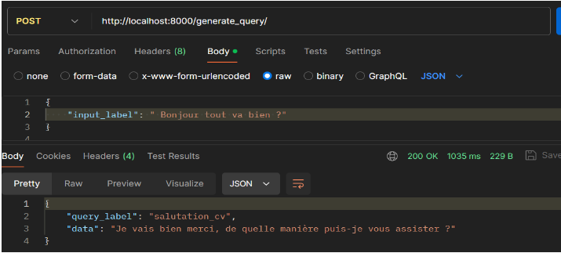
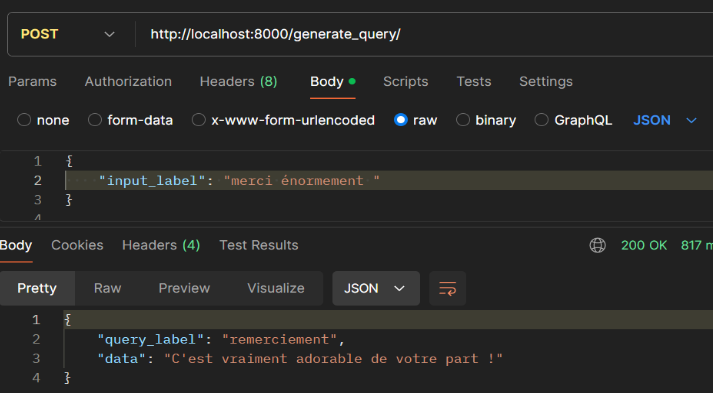
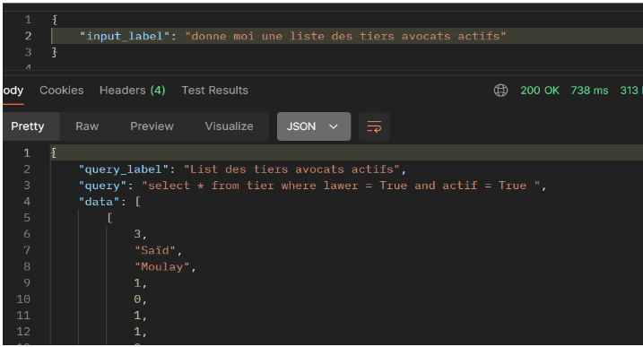
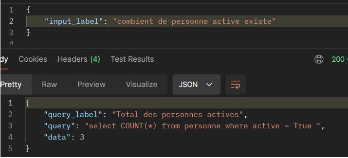
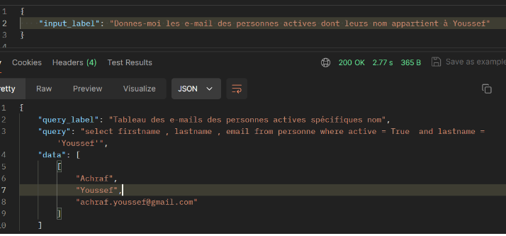
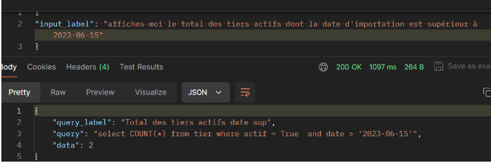

# CustomSqlChatbot

## Project Overview
The **CustomSqlChatbot** is an innovative solution designed to enable users to extract data from a database using French natural language input. The chatbot translates user queries written in French into SQL commands that interact with the database. This project explores two primary methods to determine the most efficient and cost-effective approach:
- **Method 1**: Utilizes **Large Language Models (LLMs)** to process and translate the input.
- **Method 2**: Employs **NLP and Deep Learning techniques** to achieve the same functionality.

## Objectives
- Provide a user-friendly interface for data extraction using French text.
- Develop and compare two distinct approaches (LLMs vs. NLP/Deep Learning) to optimize performance and cost.
- Ensure that the system supports complex queries and outputs accurate results.

## Technologies Used
- **Programming Language**: Python
- **Libraries and Frameworks**: TensorFlow, Keras, Spacy, NLTK, FastAPI
- **LLMs**: Open-source large language models
- **NLP Techniques**: Text classification, named entity recognition (NER), and LSTM-based models
- **Database**: MySQL
- **Frontend**: AngularJS (for chatbot UI integration)

## Features
- **French to SQL Conversion**: Seamlessly convert French queries into SQL commands.
- **Dual Method Approach**: Leverage the strengths of LLMs and deep learning NLP models.
- **Benchmarking**: Compare execution cost, training time, and accuracy of both approaches.
- **API Integration**: FastAPI for backend service handling.

## Screenshots
### Screenshot 1


### Screenshot 2


### Screenshot 3


### Screenshot 4


### Screenshot 5


### Screenshot 6


## How to Run the Project
1. **Clone the Repository**:
   ```bash
   git clone <repository-url>
